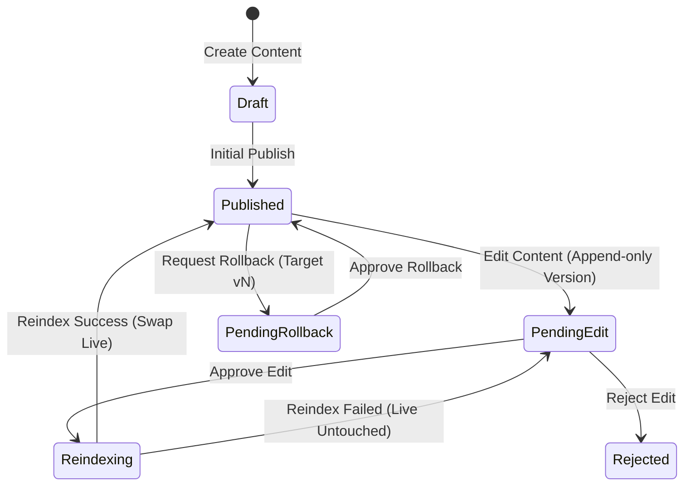

# Spec & Implementation Plan Template

## 1. Executive Summary & Problem Definition
- **Context**: [Current limitations, customer pain points, architectural gaps]
- **Proposed Solution**: [High-level architectural approach and new capabilities]

## 2. System Invariants & State Machine
Document the non-negotiable rules governing state transitions:

### Invariants:
1. **Confirm-Before-Swap**: Live served records are never mutated before background reindexing confirms success.
2. **State Isolation**: `hasPendingVersion: true` signals pending review; `status: 'Approved'` and live content remain unchanged.
3. **Collision-Proof Counters**: Query version history for highest existing number (`max(existing) + 1`); reuse existing pending version on secondary edits.
4. **Tenant Isolation**: Non-global admins can only query and mutate data where `tenantId === req.user.tenantId`.
5. **Role Hierarchy**: Only authorized managers/admins can approve, reject, delete, or rollback content.

## 3. Atomic Task Graph

| Task # | Area | Scope / Seam | Invariants Enforced | Test Suite |
| :--- | :--- | :--- | :--- | :--- |
| **Task 1** | Data Layer | Version Schemas & Model Flags | Default counters, compound unique index | `tests/schema.test.js` |
| **Task 2** | Backend API | Pending Edit & Confirm-Before-Swap | Confirm-before-swap, State isolation | `tests/editVersioning.test.js` |
| **Task 3** | Backend API | History & Rollback Endpoints | Append-only history, Tenant isolation | `tests/historyRollback.test.js` |
| **Task 4** | Background Worker | Change Detection & Staged Ingest | Collision-proof counters, Ingest staging | `pytest tests/test_worker.py` |
| **Task 5** | Frontend UI | Management Tabs, Modals & Diffs | Non-technical polish, Role gating | `npm run build` |
| **Task 6** | E2E Integration | Full Multi-System Lifecycle Pass | Zero regressions across all layers | `tests/e2eVerification.test.js` |

## 4. Multi-Tier Verification Plan
- **Unit & Component Tests**: Run on every commit.
- **Regression Suite**: Run across entire backend before any merge.
- **Frontend Production Build**: Verify zero TypeScript/JSX errors.
- **End-to-End Scenario**: Full lifecycle walkthrough with live database/server.
